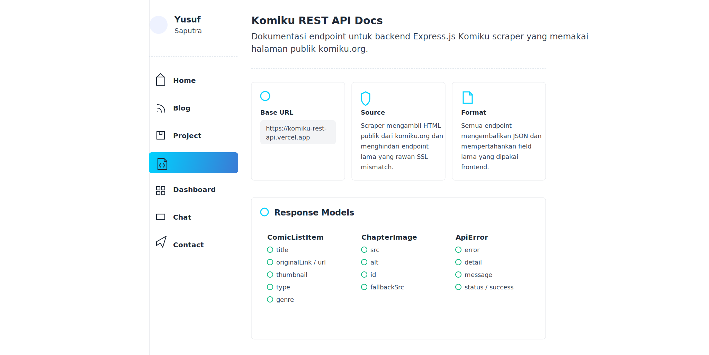

<!-- GitAds-Verify: DBW8G884X4K725U9YJY8NEG65BPFJJKJ -->

# Komiku REST API

Express.js REST API for fetching comic data from public Komiku pages.



## Links

API base URL:

```txt
https://komiku-rest-api.vercel.app
```

Swagger docs:

```txt
https://komiku-rest-api.vercel.app/api-docs
```

Static docs page:

```txt
https://vernsg.is-a.dev/komiku-api-docs
```

## Features

- Latest comics
- Comic recommendations
- Comic library with pagination
- Popular comics
- Comic details
- Chapter reader
- Comic search
- Colored comics
- Genre list and genre detail pages

## Endpoints

```txt
GET /rekomendasi
GET /terbaru
GET /pustaka
GET /pustaka/page/:page
GET /komik-populer
GET /komik-populer/manga
GET /komik-populer/manhwa
GET /komik-populer/manhua
GET /detail-komik/:slug
GET /baca-chapter/:slug/:chapter
GET /search?q=keyword
GET /berwarna
GET /berwarna/page/:page
GET /genre-all
GET /genre-rekomendasi
GET /genre/:slug
GET /genre/:slug/page/:page
```

## Quick Test

```bash
curl https://komiku-rest-api.vercel.app/terbaru
curl https://komiku-rest-api.vercel.app/detail-komik/komen-fuufu
curl https://komiku-rest-api.vercel.app/baca-chapter/komen-fuufu/19
```

## Local Development

Requirements:

- Node.js 18 or newer
- npm

Install dependencies:

```bash
npm install
```

Run development server:

```bash
npm run dev
```

Open:

```txt
http://localhost:3001
http://localhost:3001/api-docs
```

## Production

```bash
npm start
```

By default, the server uses port `3001`. You can override it with the `PORT` environment variable.

## License

ISC
