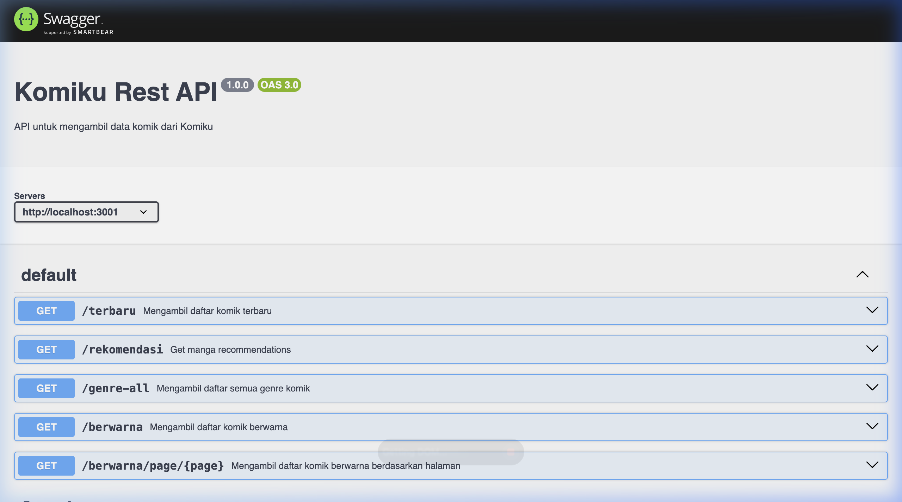

<!-- GitAds-Verify: DBW8G884X4K725U9YJY8NEG65BPFJJKJ -->

# 📚 Komiku REST API

REST API berbasis **Express.js** untuk mengambil data komik (Manga, Manhwa, Manhua) dari situs Komiku secara terstruktur, cepat, dan lengkap.

[](https://nodejs.org)
[](https://expressjs.com)
[](https://swagger.io)
[](https://opensource.org/licenses/ISC)

---

## 📸 Dokumentasi Interaktif (Swagger UI)

Akses dokumentasi interaktif untuk mencoba langsung seluruh endpoint melalui Swagger UI:



- **API Base URL**: `https://komiku-rest-api.vercel.app`
- **Swagger UI Interactive Docs**: [https://komiku-rest-api.vercel.app/api-docs](https://komiku-rest-api.vercel.app/api-docs)
- **Static Docs Page**: [https://vernsg.is-a.dev/komiku-api-docs](https://vernsg.is-a.dev/komiku-api-docs)

---

## ✨ Fitur Utama

- ⚡ **Rekomendasi & Populer**: Mengambil daftar komik rekomendasi dan komik populer berdasarkan tipe (Manga, Manhwa, Manhua).
- 🕒 **Komik Terbaru**: Update rilisan chapter terbaru secara real-time.
- 📖 **Pustaka Komik**: Katalog lengkap komik dengan dukungan pagination (`/page/:page`).
- 🔍 **Pencarian Komik**: Cari judul manga/manhwa/manhua berdasarkan kata kunci.
- 📄 **Detail Komik Lengkap**: Sinopsis, genre, status, pengarang, info tabel, komik serupa, dan seluruh daftar chapter.
- 🖼️ **Baca Chapter & Gambar**: Mengambil seluruh daftar gambar per chapter dengan navigasi previous/next chapter.
- 🎨 **Komik Berwarna & Genre**: Filter komik full-color dan filter berdasarkan puluhan genre.
- 🛡️ **Image Proxy**: Proxy gambar terintegrasi untuk menangani hotlink protection & CDN Komiku.

---

## 🛣️ Daftar Endpoint API

### 1. Komik Terbaru & Rekomendasi
| Method | Endpoint | Deskripsi |
|:---|:---|:---|
| `GET` | `/rekomendasi` | Daftar komik rekomendasi pilihan |
| `GET` | `/terbaru` | Daftar komik dengan update chapter terbaru |
| `GET` | `/komik-populer` | Daftar komik populer (Manga, Manhwa, & Manhua) |
| `GET` | `/komik-populer/manga` | Daftar manga populer |
| `GET` | `/komik-populer/manhwa` | Daftar manhwa populer |
| `GET` | `/komik-populer/manhua` | Daftar manhua populer |

### 2. Pustaka & Komik Berwarna (Pagination)
| Method | Endpoint | Deskripsi |
|:---|:---|:---|
| `GET` | `/pustaka` | Daftar katalog pustaka komik (Halaman 1) |
| `GET` | `/pustaka/page/:page` | Daftar katalog pustaka komik berdasarkan nomor halaman |
| `GET` | `/berwarna` | Daftar komik berwarna (Halaman 1) |
| `GET` | `/berwarna/page/:page` | Daftar komik berwarna berdasarkan nomor halaman |

### 3. Detail Komik & Baca Chapter
| Method | Endpoint | Deskripsi |
|:---|:---|:---|
| `GET` | `/detail-komik/:slug` | Detail informasi komik, sinopsis, info table, dan daftar chapter |
| `GET` | `/baca-chapter/:slug/:chapter` | Konten gambar chapter dan navigasi chapter sebelumnya/selanjutnya |

### 4. Pencarian & Genre
| Method | Endpoint | Deskripsi |
|:---|:---|:---|
| `GET` | `/search?q=:keyword` | Pencarian komik berdasarkan kata kunci judul |
| `GET` | `/genre-all` | Daftar seluruh genre komik yang tersedia |
| `GET` | `/genre-rekomendasi` | Daftar genre rekomendasi populer |
| `GET` | `/genre/:slug` | Daftar komik berdasarkan genre (Halaman 1) |
| `GET` | `/genre/:slug/page/:page` | Daftar komik berdasarkan genre dengan pagination |

### 5. Media & Proxy
| Method | Endpoint | Deskripsi |
|:---|:---|:---|
| `GET` | `/image-proxy?url=:imageUrl` | Proxy gambar thumbnail & chapter dari CDN Komiku |

---

## 💡 Contoh Respons JSON

### `GET /detail-komik/reality-quest`
```json
{
  "title": "Komik Reality Quest",
  "alternativeTitle": "Reality Quest",
  "description": "Sinopsis singkat komik...",
  "sinopsis": "Ha Do-wan, seorang gamer yang dipaksa main game...",
  "thumbnail": "https://thumbnail.komiku.to/uploads/manga/reality-quest/manga_thumbnail-Manga-Reality-Quest.jpg?w=500",
  "info": {
    "Judul Komik": "Reality Quest",
    "Jenis Komik": "Manhwa",
    "Konsep Cerita": "Aksi, Fantasi, Game",
    "Pengarang": "Joowon",
    "Status": "Berjalan"
  },
  "genres": ["Action", "Fantasy", "School Life"],
  "slug": "reality-quest",
  "chapters": [
    {
      "title": "Chapter 220",
      "originalLink": "https://komiku.org/reality-quest-chapter-220/",
      "apiLink": "/baca-chapter/reality-quest/220",
      "chapterNumber": "220",
      "views": "12.5rb",
      "date": "2 hari lalu"
    }
  ]
}
```

### `GET /baca-chapter/reality-quest/220`
```json
{
  "title": "Reality Quest Chapter 220",
  "mangaInfo": {
    "title": "Reality Quest",
    "apiLink": "/detail-komik/reality-quest",
    "slug": "reality-quest"
  },
  "images": [
    {
      "src": "https://img.komiku.to/upload/2026/09/reality-quest-220-1.jpg",
      "alt": "Reality Quest Chapter 220 Gambar 1",
      "id": "1"
    }
  ],
  "navigation": {
    "prevChapter": {
      "apiLink": "/baca-chapter/reality-quest/219",
      "chapter": "219"
    },
    "nextChapter": null,
    "allChapters": "/detail-komik/reality-quest"
  }
}
```

---

## 🚀 Penggunaan Cepat (cURL)

```bash
# 1. Mengambil komik terbaru
curl -s https://komiku-rest-api.vercel.app/terbaru

# 2. Mencari komik
curl -s "https://komiku-rest-api.vercel.app/search?q=naruto"

# 3. Mengambil detail komik
curl -s https://komiku-rest-api.vercel.app/detail-komik/reality-quest

# 4. Mengambil gambar chapter komik
curl -s https://komiku-rest-api.vercel.app/baca-chapter/reality-quest/220
```

---

## 💻 Menjalankan Secara Lokal

### Prasyarat
- [Node.js](https://nodejs.org) (v18.x atau lebih baru)
- `npm`

### Langkah Instalasi
1. Clone repository:
   ```bash
   git clone https://github.com/VernSG/komiku-rest-api.git
   cd komiku-rest-api
   ```

2. Pasang dependensi:
   ```bash
   npm install
   ```

3. Jalankan server mode development:
   ```bash
   npm run dev
   ```

4. Akses melalui browser:
   - **Frontend**: [http://localhost:3001](http://localhost:3001)
   - **Swagger Docs**: [http://localhost:3001/api-docs](http://localhost:3001/api-docs)

5. Menjalankan seluruh test suite endpoint:
   ```bash
   npm test
   ```

---

## 📄 Lisensi

Proyek ini berada di bawah lisensi [ISC](LICENSE).
